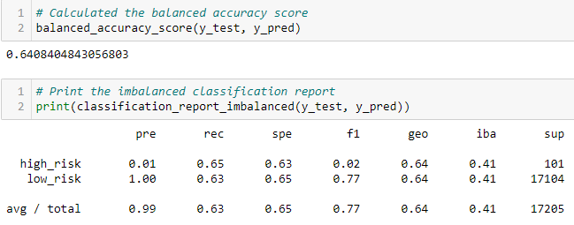
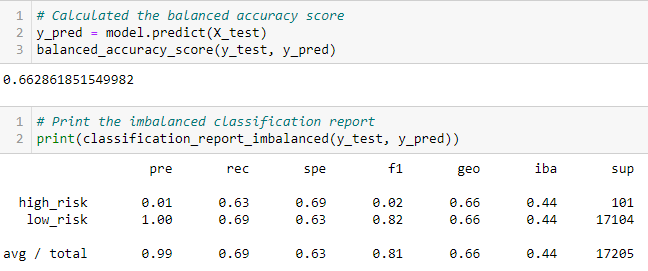
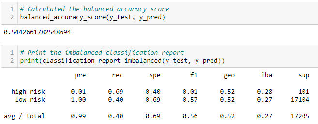
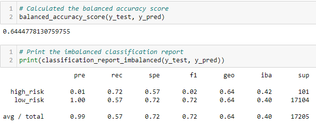
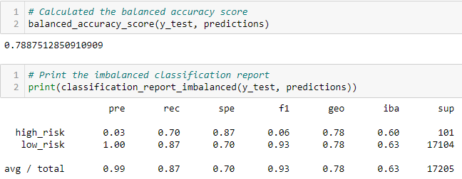
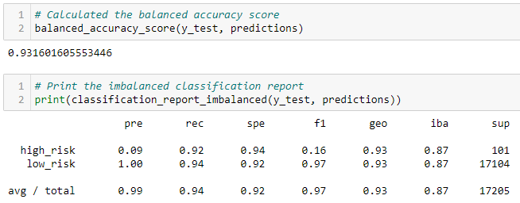

# Credit_Risk_Analysis

Module 17

## Overview

The purpose of this analysis is to compare different algorithm's evaluations of a credit data set to determine loan risk.  The models used include: oversampling, undersampling, combined over and under sampling, and two other classifier machine learning models.

## Results

### Oversampling

- Using the Random OverSampler Algorithm resulted in an accuracy score of 64%, precision score of 0.01 for high risk and 1.00 for low risk, and recall score of 65% for high risk and 63% for low risk.  This may indicate the potential for false positives in the high risk category.

<figcaption align = "center"><b>RandomOverSampler Algorithm Results</b></figcaption> 

- Using the SMOTE Algorithm resulted in an accuracy score of 66%, precision score of 0.01 for high risk and 1.00 for low risk, and recall score of 63% for high risk and 69% for low risk. This may indicate the potential for false positives in the high risk category.

<figcaption align = "center"><b>SMOTE Algorithm Results</b></figcaption> 

### Undersampling

- Using the ClusterCentroids Algorithm resulted in an accuracy score of 54%, precision score of 0.01 for high risk and 1.00 for low risk, and recall score of 69% for high risk and 40% for low risk. This may indicate the potential for false positives in the high risk category and possible false negatives in the low risk category.

<figcaption align = "center"><b>ClusterCentroids Algorithm Results</b></figcaption> 

### Under- and Over- sampling

- Using the SMOTEENN Algorithm resulted in an accuracy score of 64%, precision score of 0.01 for high risk and 1.00 for low risk, and recall score of 72% for high risk and 57% for low risk. This may indicate the potential for false positives in the high risk category.

<figcaption align = "center"><b>SMOTEENN Algorithm Results</b></figcaption> 

### Ensemble Classifiers

- Using the BalancedRandomForestClassifier Algorithm resulted in an accuracy score of 79%, precision score of 0.03 for high risk and 1.00 for low risk, and recall score of 70% for high risk and 87% for low risk. This may indicate the potential for false positives in the high risk category.

<figcaption align = "center"><b>BalancedRandomForestClassifier Algorithm Results</b></figcaption> 

- Using the EasyEnsembleClassifier Algorithm resulted in an accuracy score of 93%, precision score of 0.09 for high risk and 1.00 for low risk, and recall score of 92% for high risk and 94% for low risk. This may indicate the potential for false positives in the high risk category.

<figcaption align = "center"><b> EasyEnsembleClassifier Algorithm Results</b></figcaption> 

## Summary

All models have the potential for false positives in the high risk category.  This is not necessarily a bad feature, since those could have further evaluation to determine their status.  Most models evaluated the low risk group adequately and would correctly pass those candidates on with an approved status.  Based on the overall scores and taking accuracy into account, it appears the best model to choose for this analysis is the EasyEnsembleClassifier Algorithm.  It will be accurate a projected 93% of the time and is highly sensitive.  It also has a high F1 score meaning that the weighted average of the true positive rate (recall) and precision were good.